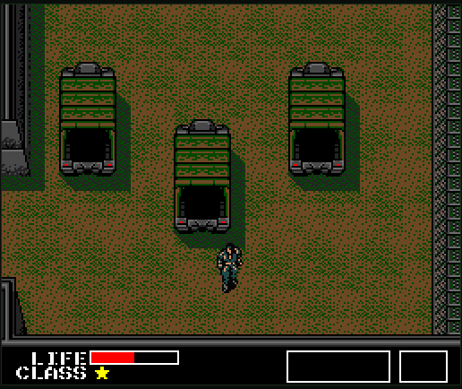
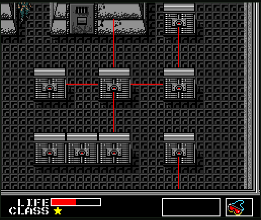

# Metal Gear — Browser Port (MetalGearJS)

A playable, faithful **browser reimplementation** of *Metal Gear* (Konami, MSX2, 1987,
cartridge code RC750) in vanilla JavaScript + Canvas — **no build step, no framework**. Snake
infiltrates Outer Heaven; you sneak past guards, collect gear, take down the bosses, and
destroy Metal Gear. Behaviour is ported routine-by-routine from the original MSX disassembly,
not reinvented.

> ⚠️ **Beta — work in progress.** The whole game is playable end-to-end, but it is **not
> finished**: expect rough edges, bugs, and documented divergences from the original
> (see the coverage notes below). Feedback and bug reports are welcome.

  
  &nbsp;
  

Left: stealth in the connected world. Right: laser cameras revealed with the infrared goggles.

## What you're looking at

This is the **whole game**, running in your browser:

- **The full world** — the title boot + scripted intro, all 235 rooms of Outer Heaven
  connected on foot and by elevator, the desert, roof, basement, and building interiors.
- **Stealth & combat** — guard patrols with line-of-sight, the alert/red-alert system and
  card-budgeted reinforcements, prisoners to rescue (and a CLASS rank that goes up/down).
- **The arsenal & gear** — handgun/suppressor, SMG, grenades, rockets, mines, plastic bombs,
  the remote-guided missile; cardboard box, infrared goggles, gas mask, cards, rations.
- **Systems** — keycard doors, elevators, laser/camera corridors, the radio/transceiver,
  the capture → prison-escape arc, hazards (gas, pitfalls, electric floors, rolling barrels),
  and the endgame countdown + ending.
- **The bosses** — Hind D, the Tank, Bulldozer, the Arnolds, Fire Trooper, Machine Gun Kid,
  the Shotgunner, and Big Boss.

**How faithful?** Constants, formulas and state machines come straight from the `.asm`
(each port cites its source routine). Coverage is **91% strict / 96% blended** of the in-scope
ROM gameplay routines with **zero `todo`s** — everything is `done` or a documented `partial`
divergence ([`docs/rom-coverage.md`](docs/rom-coverage.md)), and behaviour is pinned by ~750
assertions across 26 headless test suites.

## Play it

The browser blocks `fetch()` from `file://`, so the game is served over HTTP. With
[Node.js](https://nodejs.org/) 18+ installed:

    node web/serve.js          # serves http://localhost:8099 (honors $PORT)

Then open **http://localhost:8099**. The game boots through the title sequence (Konami logo →
the METAL GEAR logo swoop → "PUSH SPACE KEY"); **press any key** to skip the boot, then
**Space** or **M** to start (it plays the scripted intro first). The first keypress also
unlocks audio (browser policy), so an untouched boot runs silent — like the ROM's muted logo
phase. Nothing to install or build; the game runs on the assets already in `web/assets/`.

### Controls

| Action | Keys |
|--------|------|
| Move | Arrows / WASD |
| Punch | M |
| Fire | Space |
| Weapon menu / Item menu | Q / E (move the cursor to select — no confirm key, like the ROM) |
| Select weapon / holster | 1–7 / 0 · cycle item: I |
| Radio (transceiver) | R (←/→ tune, ↑ = SEND; R exits) |
| Pause | P (overlay shows the current room number) |
| Advance / dismiss text | M or Enter (a press mid-print skips to the next page) |
| File a bug report (dev/QA) | B (see below) |

### Dev hooks (URL options)

Append these to the URL for testing. All are `?query` params (combine with `&`) except
`#auto`, which is a hash — e.g. `http://localhost:8099/?room=20&arsenal` or
`?room=118&arsenal&mgko`.

| Option | Effect |
|--------|--------|
| `?room=<n>` | Jump straight to room `n`, Snake placed on open floor (ladder rooms 224–226 enter ladder mode; water rooms enter swim mode). Skips the title. |
| `#auto` | Autostart — skip the title boot. |
| `?arsenal` | Grant every weapon with ammo + the suppressor, 3 rations, **all 8 keycards**, gas mask, flashlight, antidote, bomb suit, parachute, and cigarettes — for boss/dev testing without the collection walk. |
| `?goggles` | Grant + select the infrared goggles (reveals laser beams, e.g. `?room=24&goggles` — the right-hand screenshot above). |
| `?capture` | Drop Snake inside room 8's capture-trigger zone (exercises the capture → prison-escape arc). |
| `?alert` | Force the guard alert. |
| `?red` | Force a red alert (arms reinforcements). |
| `?sleep` | Make the current room's guard start asleep (to exercise sleep/wake). |
| `?collision` | Tint solid/collision tiles. |
| `?mgko` | Destroy Metal Gear on spawn (use with `?room=118`) — shortcut to the Big Boss / countdown / escape / ending without the 16-bomb puzzle. |

See [`docs/SESSION-STATE.md`](docs/SESSION-STATE.md) for deeper notes on each.

---

## For contributors

### Relationship to the disassembly

This repository is the **JavaScript/web port and its asset toolchain**. The original MSX
disassembly (the `.asm` sources — `constants/`, `data/`, `gfx/`, `logic/`, `sound/`,
`MetalGear.asm` — plus the `room_images/` reference screenshots) lives in a **separate repo**:

> **[southernsun/MetalGear](https://github.com/southernsun/MetalGear)** — a fork of
> [GuillianSeed/MetalGear](https://github.com/GuillianSeed/MetalGear).

The **playable game** (`web/`) is self-contained — it runs on the pre-exported assets checked
into `web/assets/`, so you do **not** need the disassembly to play. You only need it to
**re-export assets** or run the C# viewers (they read the real `.asm`/data tables). Clone it
as a **sibling** of this repo so it sits at `../MetalGear`:

    GitHub/
    ├── MetalGearJS/        # this repo
    └── MetalGear/          # the disassembly (southernsun/MetalGear)

The tools default to `../MetalGear`; override the location with the `MG_ROM_DIR` environment
variable if you keep it elsewhere.

### Repository layout

- [`web/`](web/) — the playable browser port (`game.js`, `index.html`, `serve.js`) and its
  pre-exported assets ([`web/assets/`](web/assets/)), plus the headless test suites.
- [`Tools/`](Tools/) — the asset pipeline and viewers (**require the disassembly sibling**):
  - `Tools/*.mjs` — Node exporters/auditors that parse the `.asm` data tables into
    `web/assets/*.json` (items, radio, texts, actors, lasers, elevators, …).
  - `Tools/RoomViewer/`, `Tools/MetalGearGfxViewer/`, `Tools/MetalGearSpriteMover/`,
    `Tools/ThemeOfTaraPlayer/` — .NET 8 (Windows) viewers/players that also export PNG/WAV
    assets headlessly.
  - `Tools/coverage/`, `Tools/audit/` — generate the coverage and per-room/sound audit docs.
- [`docs/`](docs/README.md) — documentation: ROM internals (`docs/rom/`), the C# tools
  (`docs/tools/`), and the browser port & audits. **Start at [`docs/README.md`](docs/README.md);**
  for the port specifically, [`docs/SESSION-STATE.md`](docs/SESSION-STATE.md).
- [`examples/`](examples/) — spriters-resource sprite/tileset rips used as reference material.
- `MetalGear.sln` — Visual Studio solution for the four C# tools.

### Tests

Behaviour is locked down by ~750 assertions across **26 headless suites**
([`web/*.headless.mjs`](web/)) that load the real `game.js` under `node:vm`. Run them all:

    for f in web/*.headless.mjs; do node "$f"; done

### Asset pipeline

The assets in `web/assets/` are already exported and checked in, so playing needs nothing
else. To **regenerate** them, clone the disassembly as a sibling (`../MetalGear`, see above),
then:

- **Node exporters** (no .NET needed) parse the `.asm`/data tables, e.g.:

      node Tools/export-items.mjs        # data/itemsinrooms.asm  -> web/assets/items.json
      node Tools/export-texts.mjs        # data/texts.asm         -> web/assets/texts.json
      node Tools/export-actors.mjs       # data/actorsinrooms.asm -> web/assets/actors.json

  (also `export-radio`, `export-radiocalls`, `export-elevators`, `export-lasers`,
  `export-guard-palettes`, `export-respawn`, …). If the disassembly isn't found, the script
  errors with how to fix it (`MG_ROM_DIR` / sibling clone).

- **C# tools** (Windows, [.NET 8 SDK](https://dotnet.microsoft.com/)) export graphics and
  audio headlessly, e.g.:

      dotnet run --project Tools/RoomViewer -- --export-web           # rooms/collision/doors/HUD/font
      dotnet run --project Tools/MetalGearSpriteMover -- --export-web  # Snake sprites
      dotnet run --project Tools/ThemeOfTaraPlayer -- --export-punch   # SFX/music WAVs

  See [`docs/SESSION-STATE.md`](docs/SESSION-STATE.md) for the full export command list and
  each tool's own `README.md` for running it interactively.

### ROM coverage

[`docs/rom-coverage.md`](docs/rom-coverage.md) tracks, per gameplay component, how much of the
original ROM has been reimplemented (currently **91% strict / 96% blended**, zero `todo`s). It
is generated from a curated map
([`Tools/coverage/coverage-map.json`](Tools/coverage/coverage-map.json)) plus routine labels
parsed from the disassembly:

    node Tools/coverage/refresh.mjs
    node Tools/coverage/coverage.mjs

### In-game bug reporter (optional, dev/QA)

Pressing **B** files a GitHub issue with the last ~20s of gameplay (canvas video + audio).
This is a development tool, not a ROM feature. To enable it, copy
[`web/.env.example`](web/.env.example) to `web/.env` (gitignored) and add a fine-grained PAT
(Contents + Issues: read/write). The target repo defaults to `southernsun/MetalGearJS`
(`GITHUB_REPO` to override).

## Legal notice

This repository is provided "as is" for **educational purposes only**. Metal Gear is a
trademark of Konami; any non-educational use may be illegal if you do not own an original copy
of the game. The original disassembly is © its respective authors (see
[southernsun/MetalGear](https://github.com/southernsun/MetalGear) /
[GuillianSeed/MetalGear](https://github.com/GuillianSeed/MetalGear)).
